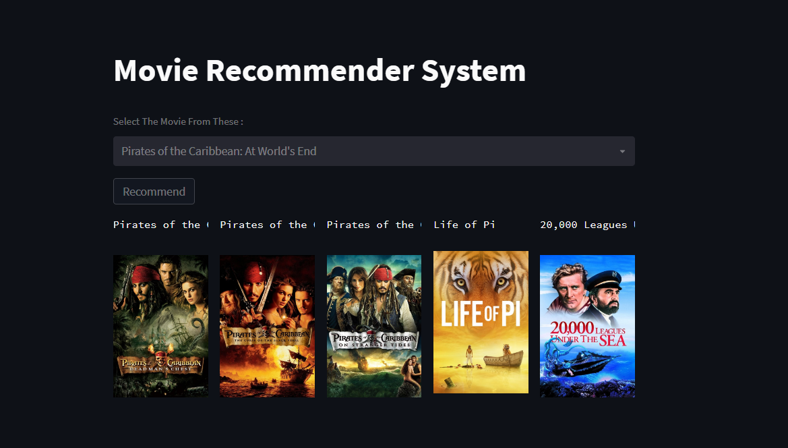

# Movies-Recommendation-System

This is a content-based Movie Recommendation System built using Natural Language Processing (NLP) techniques and deployed via a user-friendly Streamlit web application. The system recommends movies similar to a user-selected movie by analyzing key textual features such as cast, crew, genre, and overview. Additionally, it enhances the user experience by displaying movie posters, dynamically fetched using the TMDb API.

---
<h3 align="center">App Preview</h3>

  

## 📌 Features

The system recommends movies based on their metadata, not user ratings or watch history. It intelligently combines multiple attributes like genres, plot summaries, keywords, actors, and directors to understand the essence of each film. Using NLP and vectorization techniques, it calculates the similarity between movies and suggests the most relevant ones. A clean and minimalistic Streamlit UI allows users to interactively select a movie and view its top 5 similar recommendations along with their posters.

---

## 📊 Dataset & Preprocessing

The dataset used in this project includes columns such as movie title, genres, overview, cast, crew, and keywords. As a first step, unnecessary columns were removed and missing values were handled. From the `cast` column, the top three actors or actresses were extracted, and from the `crew`, key roles like the director and producer were identified. These were then converted into lowercase strings and white spaces were removed to ensure uniformity.

All these processed text-based fields were concatenated to form a new column named `tags`. This column serves as a textual fingerprint for each movie, combining all meaningful metadata into one comprehensive field. This fusion of content ensures that the system captures the full context of a movie before moving on to the recommendation phase.

---

## 🧠 Natural Language Processing (NLP)

To prepare the textual data for modeling, several standard NLP preprocessing steps were applied. This included removal of stopwords (common but uninformative words like “the”, “a”, etc.), punctuation cleaning, and stemming using the Porter Stemmer algorithm. Stemming was crucial in reducing words to their root forms, ensuring that similar words like “acting”, “acted”, and “actor” were treated the same during vectorization. These steps improved both the performance and accuracy of the similarity model.

---

## 🧮 Vectorization & Similarity

The cleaned `tags` column was converted into numerical form using `CountVectorizer`, a technique that transforms text into a matrix of token counts. A vocabulary size limit of 5000 was set, and common English stopwords were excluded to avoid noise in the feature vectors. Each movie was thus represented by a vector in a multi-dimensional space, allowing us to mathematically measure the closeness between any two movies.

The similarity between movies was calculated using **cosine similarity**, which measures the cosine of the angle between two vectors. A higher cosine similarity score indicates that the two movies share more common features, and thus, are more likely to appeal to similar audiences.

---

## 🔍 Recommendation Logic

Once a user selects a movie, the system retrieves its corresponding vector and compares it with the vectors of all other movies using cosine similarity. It then sorts the results in descending order of similarity and recommends the top 5 most similar movies, excluding the selected one. This ensures that the recommendations are highly relevant and content-driven, rather than based on external ratings or popularity metrics.

---

## 🖥️ Streamlit Web Application

The recommendation engine is integrated into a simple yet elegant web interface built with Streamlit. The homepage features a dropdown menu from which the user can select any movie. Upon clicking the "Recommend" button, the app displays the recommended movies along with their official posters, giving it a modern, Netflix-like touch.

To fetch high-quality movie posters, we used [TMDb API](https://www.themoviedb.org/documentation/api). Movie IDs from our dataset were mapped to TMDb’s endpoints to retrieve poster URLs.

---

## 🧰 Technologies & Libraries Used

* **Python** – core language used for implementation
* **Pandas**, **NumPy** – for data manipulation
* **Scikit-learn** – for CountVectorizer and similarity calculations
* **NLTK** – for stopwords removal and stemming
* **Requests** – for API calls to TMDb
* **Streamlit** – to build the interactive web application

---

## 🚀 Future Improvements

* Integrate collaborative filtering for hybrid recommendations
* Add IMDb ratings, trailer links, and genre filters
* Deploy the app online using platforms like Streamlit Cloud, Render, or Vercel
* Make the UI more dynamic with search history and favorites

---

Let me know if you want me to add:

* A `requirements.txt`
* Screenshots of the app
* Deployment instructions
* or the code explanation for `app.py`

Ready hoon!
